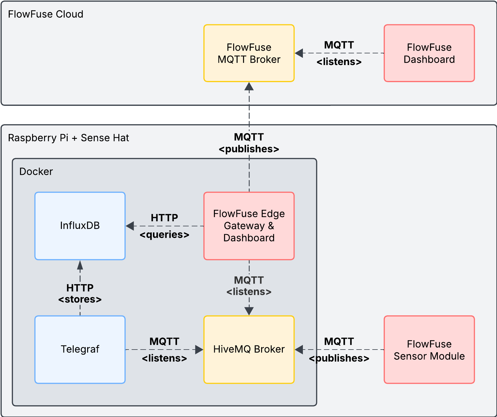

# User Manual <!-- omit in toc -->

- [Overview](#overview)
- [Getting started](#getting-started)
  - [Connecting to the Raspberry Pi](#connecting-to-the-raspberry-pi)
  - [Starting the services](#starting-the-services)
- [Accessing the services](#accessing-the-services)
  - [FlowFuse instance(s)](#flowfuse-instances)
    - [Sensor Module (remote instance)](#sensor-module-remote-instance)
    - [Edge Gateway \& Local Dashboard (local instance)](#edge-gateway--local-dashboard-local-instance)
    - [FlowFuse Dashboard (hosted instance)](#flowfuse-dashboard-hosted-instance)
  - [MQTT Broker](#mqtt-broker)
  - [InfluxDB](#influxdb)
  - [Telegraf](#telegraf)

## Overview

This user manual describes how to use the FlowFuse instance(s) and the other
services that are part of the UNS In A Box project. The following diagram shows
an overview of the setup:



> [!NOTE]
>
> This user manual is intended for the users of the UNS In A Box project. If
> you are a developer, please refer to the [developer manual](doc/developer-manual.md)
> for a full guide on how to install and configure the project.

## Getting started

### Connecting to the Raspberry Pi

Establish a wired ethernet connection between the Raspberry Pi and your
computer. The Raspberry Pi will automatically obtain an IP address via DHCP,
which will be displayed in the terminal of the Raspberry Pi after startup.

Use one of the following commands to connect to the Raspberry Pi:

```bash
# Connect to the Raspberry Pi using the hostname
ssh admin@raspberrypi.local

# Connect to the Raspberry Pi using the IP address
ssh admin@<ip-address>
```

> [!NOTE]
> The default credentials are:
>
> - Username: `admin`
> - Password: `admin`

### Starting the services

This repository was cloned to the Raspberry Pi during the installation process.
You can locate it at `/home/admin/hannover-messe-2025-edge-gateway`.

To start the services, run the following command:

```bash
# Navigate to the repository
cd /home/admin/hannover-messe-2025-edge-gateway

# Start the services
docker compose up -d

# Check the status of the services
docker compose ps

# Check the logs of a specific service (run without specifying the service name to see all logs)
docker compose logs <service-name>
```

To restart the services, run the following command:

```bash
docker compose restart
```

To stop the services, run the following command:

```bash
docker compose down
```

## Accessing the services

### FlowFuse instance(s)

To access any of the FlowFuse instances, go to the FlowFuse Dashboard and find
the instance you want to access. **The underside of the Raspberry Pi has a QR
code that links to the FlowFuse Dashboard**.

#### Sensor Module (remote instance)

The Sensor Module is a FlowFuse remote instance that is used to collect data
from the Sensor HAT on the Raspberry Pi. It is installed on the Raspberry Pi
directly instead of being deployed inside the docker cluster. This makes it
easier to access the hardware-specific features of the Sensor HAT module.

To access the editor, go to the FlowFuse Dashboard and look for it in the
**Remote Instances** section.

#### Edge Gateway & Local Dashboard (local instance)

The Edge Gateway is a FlowFuse remote instance that serves as a gateway for
the local instance to connect to the FlowFuse Cloud (and vice versa). It is
installed inside the docker cluster.

To access the editor, go to the FlowFuse Dashboard and look for it in the
**Remote Instances** section.

#### FlowFuse Dashboard (hosted instance)

The Dashboard is a FlowFuse hosted instance that is used to visualize the data
from the FlowFuse instance(s) sent to the FlowFuse Cloud via its MQTT broker.

To access the Dashboard, go to the FlowFuse Dashboard and look for it in the
**Hosted Instances** section.

### MQTT Broker

The MQTT Broker is a HiveMQ (Community Edition) instance that is installed
inside the docker cluster.

To access the MQTT Broker, you can use any MQTT client. The connection details
are:

From within the docker cluster (e.g. from any of the FlowFuse instances):

- Host: `hivemq`
- Port: `1883`

From outside the docker cluster:

- Host: `raspberrypi.local` or `<ip-address>`
- Port: `1883`

### InfluxDB

The InfluxDB instance is a timeseries database used to store the the MQTT
messages collected by the Telegraf instance. It can also be written to and read
from by the local FlowFuse instance(s).

To access the InfluxDB, you can use any InfluxDB client. The connection details
are:

From within the docker cluster (e.g. from any of the FlowFuse instances):

- Host: `influxdb`
- Port: `8086`

From outside the docker cluster:

- Host: `raspberrypi.local` or `<ip-address>`
- Port: `8086`

> [!NOTE]
>
> Use the credentials set in the `.env` file at the root of the repository to
> access the InfluxDB.
>
> The default credentials are:
>
> - Username: `admin`
> - Password: `HannoverMesse2025`
> - Organization: `mayker`
> - Bucket: `iot-data`
> - Token: `HannoverMesse2025`

### Telegraf

Telegraf is configured to collect data from the HiveMQ MQTT broker and write it
to InfluxDB. The Telegraf configuration file is located at
`telegraf/config/telegraf.conf`.

By default, Telegraf subscribes to all topics (`#`) on the MQTT broker and
writes the data to InfluxDB. The data is stored in the bucket specified in the
`.env` file with the organization and token also specified there.

If you need to customize the Telegraf configuration, you can edit the
configuration file and restart the service with:

```bash
docker compose restart telegraf
```
